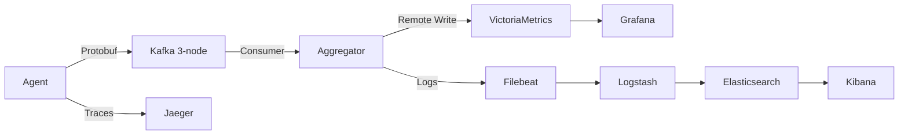
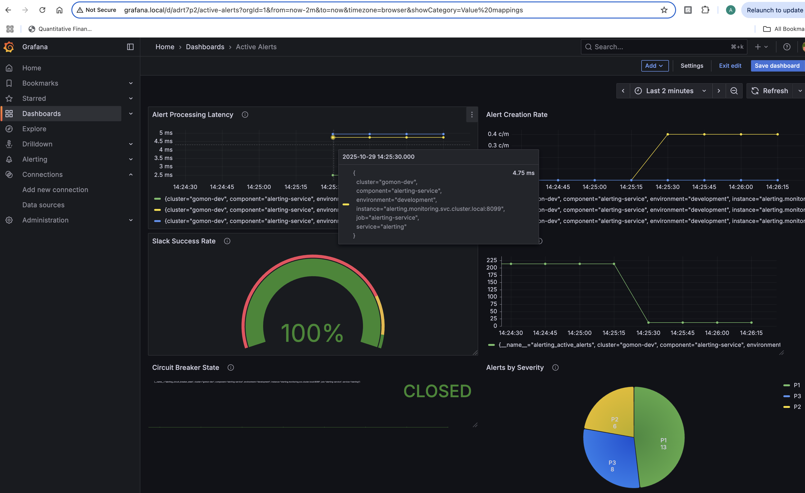

# GoMon - Kubernetes Monitoring Platform

A production-ready monitoring and observability platform for Kubernetes with real-time metrics, distributed tracing, log aggregation, and intelligent alerting.

[](https://kubernetes.io/)
[](https://golang.org/)
[](https://www.terraform.io/)

---

## 🎯 What is GoMon?

GoMon is a **complete observability stack** running on Kubernetes that monitors system metrics, application logs, and distributed traces. Built with Go microservices, it demonstrates modern SRE practices including circuit breakers, graceful degradation, and GitOps deployment.

---

## 🏗️ Architecture

```
┌─────────────────────────────────────────────────────────┐
│              Kubernetes Cluster (monitoring ns)          │
│                                                          │
│  Metrics:  Agent → Kafka → Aggregator → VictoriaMetrics │
│  Logs:     App → Filebeat → Logstash → Elasticsearch    │
│  Traces:   Services → Jaeger Collector → Jaeger UI      │
│  Alerts:   Alerting Service → Slack + PostgreSQL        │
│                                                          │
│  Visualization: Grafana | Kibana | Jaeger UI            │
└─────────────────────────────────────────────────────────┘
```

### **Data Flow**



---

## 📊 Key Features

### **Metrics Collection & Visualization**
- ✅ Real-time system metrics (CPU, memory, disk, network)
- ✅ VictoriaMetrics for efficient time-series storage
- ✅ Grafana dashboards with custom panels
- ✅ Prometheus-compatible metrics endpoint

### **Intelligent Alerting**
- ✅ RESTful alert management API
- ✅ PostgreSQL backend with JSONB support
- ✅ Slack notifications with circuit breaker pattern
- ✅ Kubernetes pod health monitoring
- ✅ Auto-resolution of transient issues

### **Observability Stack**
- ✅ Distributed tracing with Jaeger
- ✅ Centralized logging (ELK stack)
- ✅ Real-time metrics dashboards
- ✅ Code quality analysis (SonarQube)

### **Production-Ready Patterns**
- ✅ Circuit breaker for external API calls
- ✅ Graceful degradation (alerts saved even when Slack fails)
- ✅ Infrastructure as Code (Terraform)
- ✅ GitOps deployment ready
- ✅ Multi-container pods with sidecars

---

## 🚀 Quick Start

### **Prerequisites**
- Docker Desktop with Kubernetes enabled
- kubectl configured
- 16GB+ RAM

### **1. Deploy Infrastructure**

```bash
# Clone repository
git clone https://github.com/0xAxPx/gomon.git
cd gomon

# Deploy with Terraform
cd terraform
terraform init
terraform apply

# Or deploy with kubectl
kubectl apply -f k8s/
```

### **2. Configure Local Access**

Add to `/etc/hosts`:
```bash
127.0.0.1 grafana.local kibana.local jaeger.local alerting.local victoria.local
```

### **3. Access Dashboards**

| Service | URL | Credentials |
|---------|-----|-------------|
| **Grafana** | http://grafana.local | admin/admin |
| **Kibana** | http://kibana.local | - |
| **Jaeger** | http://jaeger.local | - |
| **VictoriaMetrics** | http://victoria.local | - |
| **Alerting API** | http://alerting.local | - |

---

## 📈 Monitoring Dashboard



**Dashboard includes:**
- Active alerts counter
- Alert creation rate trends
- Severity distribution (pie chart)
- Circuit breaker health status
- Slack notification success rate
- API processing latency (p50, p95, p99)

### **Creating Custom Dashboards**

1. Add VictoriaMetrics data source in Grafana:
   - URL: `http://victoria-metrics.monitoring.svc.cluster.local:8428`
   - Type: Prometheus

2. Import dashboard or build custom panels using PromQL queries

3. Available metrics:
   ```promql
   alerting_active_alerts
   alerting_alerts_created_total{severity="P1"}
   alerting_circuit_breaker_state
   alerting_alert_processing_duration_seconds
   slack_notifications_sent_total{status="success"}
   ```

---

## 🛠️ Technology Stack

**Languages:** Go 1.22  
**Container Orchestration:** Kubernetes + Docker  
**Message Queue:** Apache Kafka (3-node cluster)  
**Databases:** PostgreSQL 15, VictoriaMetrics  
**Observability:** Grafana, Kibana, Jaeger  
**IaC:** Terraform  
**Serialization:** Protocol Buffers  

---

## 🎯 Core Services

### **1. Agent** (`ragazzo271985/agent:latest`)
Collects system metrics every 20s and publishes to Kafka.

**Resources:** 256Mi RAM, 200m CPU

### **2. Aggregator** (`ragazzo271985/aggregator:latest`)
Consumes metrics from Kafka, processes, and writes to VictoriaMetrics.

**Resources:** 512Mi RAM, 200m CPU  
**Features:** Filebeat sidecar for log shipping

### **3. Alerting Service** (`ragazzo271985/alerting-service:latest`)
Manages alerts with PostgreSQL backend and Slack integration.

**Resources:** 256Mi RAM, 100m CPU  
**API Endpoints:**
```bash
POST   /api/v1/alerts          # Create alert
GET    /api/v1/alerts          # List alerts
GET    /api/v1/alerts/:id      # Get alert details
PUT    /api/v1/alerts/:id/acknowledge
PUT    /api/v1/alerts/:id/resolve
DELETE /api/v1/alerts/:id
GET    /health/database        # Health check
GET    /metrics                # Prometheus metrics
```

**Circuit Breaker Configuration:**
```yaml
slack:
  circuit_breaker:
    failure_threshold: 5      # Open after 5 failures
    timeout_duration: 60      # Test recovery after 60s
    half_open_max_requests: 3 # Allow 3 test requests
```

---

## 📊 Example Queries

### **PromQL (Grafana/VictoriaMetrics)**

```promql
# Alert creation rate (per minute)
rate(alerting_alerts_created_total[5m]) * 60

# Alerts by severity
sum by(severity) (alerting_alerts_created_total)

# API latency 95th percentile
histogram_quantile(0.95, rate(alerting_alert_processing_duration_seconds_bucket[5m]))

# Slack success rate
(rate(slack_notifications_sent_total{status="success"}[5m]) / 
 rate(slack_notifications_sent_total[5m])) * 100
```

### **Create Alert via API**

```bash
curl -X POST http://alerting.local/api/v1/alerts \
  -H "Content-Type: application/json" \
  -d '{
    "source": "kubernetes",
    "severity": "P1",
    "title": "High CPU Usage",
    "description": "Pod cpu-intensive is using 95% CPU",
    "namespace": "production"
  }'
```

---

## 🔧 Configuration

### **VictoriaMetrics Scrape Config**

Configured via Terraform to scrape metrics every 30s:

```yaml
scrape_configs:
- job_name: 'alerting-service'
  static_configs:
  - targets: ['alerting.monitoring.svc.cluster.local:8099']
  metrics_path: '/metrics'
  scrape_interval: 30s
```

### **PostgreSQL Schema**

```sql
-- Active alerts table
CREATE TABLE alerts_active (
  id UUID PRIMARY KEY,
  source VARCHAR CHECK (source IN ('grafana', 'kubernetes', 'health-check', 'api')),
  severity VARCHAR CHECK (severity IN ('P0', 'P1', 'P2', 'P3', 'P4')),
  status VARCHAR DEFAULT 'firing',
  title VARCHAR NOT NULL,
  description TEXT,
  namespace VARCHAR,
  labels JSONB,
  created_at TIMESTAMP DEFAULT NOW(),
  resolved_at TIMESTAMP
);
```

---

## 📁 Project Structure

```
gomon/
├── agent/                   # Metrics collector
├── aggregator/              # Data processor
├── alerting/                # Alert management service
│   ├── cmd/main.go
│   ├── internal/
│   │   ├── handlers/       # HTTP handlers
│   │   ├── repository/     # Database layer
│   │   ├── slack/          # Slack client + circuit breaker
│   │   ├── metrics/        # Prometheus metrics
│   │   └── k8s/            # Kubernetes watchers
│   ├── configs/            # Configuration files
│   └── Dockerfile.alerting
├── terraform/               # Infrastructure as Code
│   └── main.tf             # K8s resources
├── k8s/                    # Kubernetes manifests
├── docs/                   # Documentation
│   ├── images/             # Screenshots
│   ├── gomon-alerting-design.md
│   └── gomon_infrastructure_design.md
└── README.md
```

---

## 🧪 Testing

### **Unit Tests**

```bash
cd alerting
go test -v ./...
```

### **Integration Tests**

```bash
# Test circuit breaker
for i in {1..10}; do
  curl -X POST http://alerting.local/api/v1/alerts \
    -H "Content-Type: application/json" \
    -d '{"source":"kubernetes","severity":"P1","title":"Test","namespace":"test"}'
  sleep 1
done

# Check circuit breaker opened after 5 failures
kubectl logs -n monitoring -l app=alerting | grep "CIRCUIT BREAKER OPENED"
```

---

## 📈 Performance

**Current Metrics:**
- **Throughput:** 3 metrics/second per agent
- **Latency:** ~4.75ms average API response time
- **Reliability:** 100% Slack notification success (with circuit breaker)
- **Storage:** 29Gi PVC allocation
- **Resource Usage:** 10-15Gi memory, 4-6 CPU cores

---

## 🗺️ Roadmap

### ✅ **Completed**
- Real-time metrics collection
- Distributed tracing integration
- Centralized logging (ELK)
- Alert management API
- Circuit breaker pattern
- Grafana dashboards
- Terraform deployment
- Prometheus metrics export

### 🔄 **In Progress**
- Kubernetes health monitoring
- Alert correlation
- Auto-resolution logic

### 📋 **Planned**
- Opsgenie integration
- Grafana alerting rules
- Advanced analytics
- Multi-cluster support
- Cloud migration (AWS EKS)

---

## 🤝 Contributing

This is a learning-focused project. Contributions welcome!

1. Fork the repository
2. Create feature branch (`git checkout -b feature/amazing`)
3. Commit changes (`git commit -m 'Add feature'`)
4. Push to branch (`git push origin feature/amazing`)
5. Open Pull Request

---

## 📝 License

Open-source for educational purposes.

---

## 👤 Author

**GitHub:** [@0xAxPx](https://github.com/0xAxPx)

---

## 🙏 Acknowledgments

Built with: Kubernetes, Go, Kafka, Grafana, Elasticsearch, Jaeger, VictoriaMetrics, and the amazing open-source community.

---

**Status:** ✅ Production-ready  
**Last Updated:** October 29, 2025