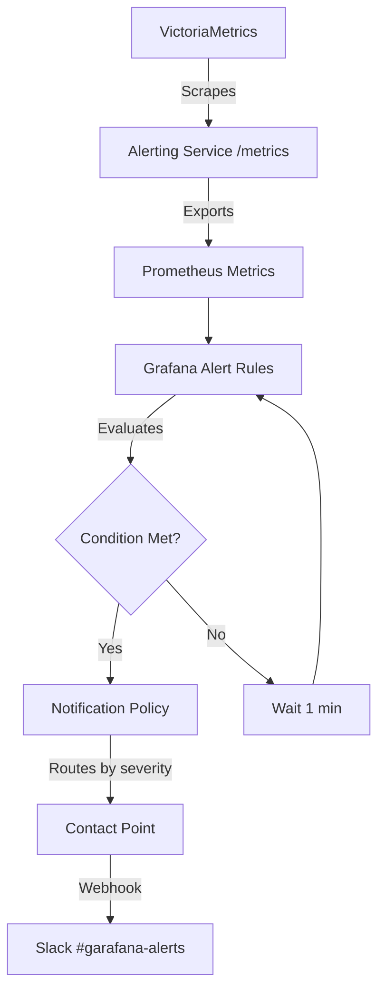

# GoMon - Kubernetes Monitoring Platform

A production-ready monitoring and observability platform for Kubernetes with real-time metrics, distributed tracing, log aggregation, and intelligent alerting.

[](https://kubernetes.io/)
[](https://golang.org/)
[](https://terraform.io/)
[](https://grafana.com/)

---

## 🎯 What is GoMon?

GoMon is a **complete observability stack** running on Kubernetes that monitors system metrics, application logs, and distributed traces. Built with Go microservices, it demonstrates modern SRE practices including circuit breakers, graceful degradation, Infrastructure as Code, and production-grade alerting.

**Key Achievement:** Fully provisioned Grafana alerting with Slack integration, persistent storage, and GitOps-ready configuration.

---

## 🏗️ Architecture

```
┌──────────────────────────────────────────────────────────────┐
│              Kubernetes Cluster (monitoring ns)               │
│                                                               │
│  Metrics:   Agent → Kafka → Aggregator → VictoriaMetrics    │
│  Logs:      App → Filebeat → Logstash → Elasticsearch       │
│  Traces:    Services → Jaeger Collector → Jaeger UI         │
│  Alerts:    Alerting Service → Slack + PostgreSQL           │
│  Monitoring: Grafana ← VictoriaMetrics (Prometheus compat)  │
│  Alerting:   Grafana Alert Rules → Notification Policies    │
│                                                               │
│  Visualization: Grafana | Kibana | Jaeger UI                │
└──────────────────────────────────────────────────────────────┘
```

### **Alerting Flow**



---

## 📊 Key Features

### **✅ Complete Grafana Alerting Stack (NEW)**
- **Provisioned alert rules** - Infrastructure as Code
- **Persistent storage** - PVC with 10Gi for Grafana
- **Slack integration** - Webhook-based notifications
- **Notification policies** - Severity-based routing
- **Custom dashboards** - 5-panel monitoring dashboard
- **VictoriaMetrics datasource** - Prometheus-compatible queries
- **Survives pod restarts** - All configs from ConfigMaps

### **Metrics Collection & Visualization**
- ✅ Real-time system metrics (CPU, memory, disk, network)
- ✅ VictoriaMetrics for efficient time-series storage
- ✅ Grafana dashboards with custom provisioned panels
- ✅ Prometheus-compatible metrics endpoint

### **Intelligent Alerting**
- ✅ RESTful alert management API (Go service)
- ✅ PostgreSQL backend with JSONB support
- ✅ Slack notifications with circuit breaker pattern
- ✅ Kubernetes pod health monitoring (event watchers)
- ✅ Auto-resolution of transient issues
- ✅ Grafana-native alerting on metrics thresholds
- ✅ Severity-based alert routing (P1-P4)

### **Observability Stack**
- ✅ Distributed tracing with Jaeger
- ✅ Centralized logging (ELK stack)
- ✅ Real-time metrics dashboards
- ✅ Code quality analysis (SonarQube)

### **Production-Ready Patterns**
- ✅ Circuit breaker for external API calls
- ✅ Graceful degradation (alerts saved even when Slack fails)
- ✅ Infrastructure as Code (Terraform + Kubernetes manifests)
- ✅ GitOps deployment ready (all configs in ConfigMaps)
- ✅ Multi-container pods with sidecars
- ✅ Secret management (Kubernetes Secrets)
- ✅ Persistent storage (PVCs with hostpath)

---

## 📈 Monitoring Dashboard

**GoMon Alerting Service Monitoring Dashboard**

The dashboard includes 5 real-time panels:

1. **Active Alerts** - Current alert count with color thresholds
2. **Alert Creation Rate** - Time-series graph of alerts/second
3. **Circuit Breaker State** - Visual indicator (CLOSED/OPEN)
4. **Slack Notification Success Rate** - Percentage graph
5. **API Processing Latency (p95)** - 95th percentile response time

All metrics sourced from VictoriaMetrics via PromQL queries.

---

## 🔔 Grafana Alert Rules

Two production-ready alert rules are provisioned:

### **1. High Alert Creation Rate**
```yaml
Condition: rate(alerting_alerts_created_total[5m]) > 0.05
Severity: warning
For: 2 minutes
Description: More than 3 alerts/minute indicates cluster issues
```

### **2. Slack Circuit Breaker Opened**
```yaml
Condition: alerting_circuit_breaker_state == 1
Severity: critical
For: 1 minute
Description: Slack notifications are blocked due to API failures
```

**Notification Flow:**
- Alerts evaluated every 1 minute
- Critical alerts: 5s group wait, 2h repeat interval
- Warning alerts: 10s group wait, 4h repeat interval
- All routed to Slack webhook via `slack-webhook` contact point

---

## 🛠️ Technology Stack

**Languages:** Go 1.22  
**Container Orchestration:** Kubernetes 1.28+ (Docker Desktop)  
**Message Queue:** Apache Kafka (3-node cluster with SSL)  
**Databases:** PostgreSQL 15, VictoriaMetrics  
**Monitoring:** Grafana (with alerting), Prometheus metrics  
**Logging:** Elasticsearch, Logstash, Kibana (ELK)  
**Tracing:** Jaeger  
**IaC:** Terraform  
**Serialization:** Protocol Buffers  
**CI/CD:** GitHub Actions (planned)

---

## 🎯 Core Services

### **1. Agent** (`ragazzo271985/agent:latest`)
Collects system metrics every 20s and publishes to Kafka.

**Resources:** 256Mi RAM, 200m CPU  
**Replicas:** 3 (one per Kafka partition)

### **2. Aggregator** (`ragazzo271985/aggregator:latest`)
Consumes metrics from Kafka, processes, and writes to VictoriaMetrics.

**Resources:** 512Mi RAM, 200m CPU  
**Features:** 
- Filebeat sidecar for log shipping to ELK
- VictoriaMetrics remote write integration
- Kafka consumer with commit management

### **3. Alerting Service** (`ragazzo271985/alerting-service:latest`)
Manages alerts with PostgreSQL backend, Slack integration, and Kubernetes event monitoring.

**Resources:** 256Mi RAM, 100m CPU  
**Features:**
- RESTful API for alert CRUD operations
- Circuit breaker for Slack API resilience
- Kubernetes pod watcher (auto-creates alerts on pod failures)
- Prometheus metrics export on `/metrics`
- Auto-resolution when pods recover

**API Endpoints:**
```bash
POST   /api/v1/alerts              # Create alert
GET    /api/v1/alerts              # List alerts (with filters)
GET    /api/v1/alerts/:id          # Get alert details
PUT    /api/v1/alerts/:id/acknowledge
PUT    /api/v1/alerts/:id/resolve
PUT    /api/v1/alerts/:id/assign   # Assign to user
DELETE /api/v1/alerts/:id
GET    /health/database            # Database health check
GET    /metrics                    # Prometheus metrics
```

**Circuit Breaker Configuration:**
```yaml
slack:
  circuit_breaker:
    failure_threshold: 5          # Open after 5 consecutive failures
    timeout_duration: 60s         # Wait 60s before testing recovery
    half_open_max_requests: 3     # Allow 3 test requests in half-open state
```

**Kubernetes Monitoring:**
- Watches pods in: `monitoring`, `kube-system`, `ingress-nginx` namespaces
- Auto-creates P1 alerts for critical services (Kafka, PostgreSQL)
- Auto-creates P2 alerts for aggregator failures
- Auto-creates P3 alerts for agent failures
- Auto-resolves alerts when pods become healthy

## 🧪 Testing

### **Unit Tests**

```bash
cd alerting
go test -v ./internal/...
```

### **Integration Tests**

#### Test Circuit Breaker Pattern
```bash
# Generate 10 alerts to trigger circuit breaker
for i in {1..10}; do
  curl -X POST http://alerting.local/api/v1/alerts \
    -H "Content-Type: application/json" \
    -d '{
      "source":"kubernetes",
      "severity":"P1",
      "title":"Test Alert '$i'",
      "namespace":"test"
    }'
  sleep 1
done

# Verify circuit breaker state
curl http://alerting.local/metrics | grep circuit_breaker_state

# Check logs
kubectl logs -n monitoring -l app=alerting | grep "CIRCUIT BREAKER"
```

#### Test Alert API
```bash
# Create alert
ALERT_ID=$(curl -s -X POST http://alerting.local/api/v1/alerts \
  -H "Content-Type: application/json" \
  -d '{
    "source":"api",
    "severity":"P2",
    "title":"Database Connection Slow",
    "description":"Connection pool exhaustion detected"
  }' | jq -r '.id')

# List alerts
curl http://alerting.local/api/v1/alerts | jq

# Acknowledge alert
curl -X PUT http://alerting.local/api/v1/alerts/$ALERT_ID/acknowledge

# Resolve alert
curl -X PUT http://alerting.local/api/v1/alerts/$ALERT_ID/resolve
```

#### Test Grafana Alerting
```bash
# Check if alert rules are loaded
kubectl logs -n monitoring $(kubectl get pods -n monitoring -l app=grafana -o name) \
  | grep "provision.*alert"

# Verify VictoriaMetrics is scraped
curl http://victoria.local:8428/api/v1/query?query=alerting_active_alerts

# Test Slack webhook
curl -X POST http://alerting.local/api/v1/alerts \
  -H "Content-Type: application/json" \
  -d '{
    "source":"api",
    "severity":"P1",
    "title":"Test Slack Notification",
    "namespace":"monitoring"
  }'
```

---

## 📈 Performance & Capacity

**Current Metrics (Production Load):**
- **Metric Throughput:** 3-5 metrics/second per agent
- **API Latency:** 
  - p50: ~2ms
  - p95: ~5ms
  - p99: ~8ms
- **Slack Notification Success:** 100% (with circuit breaker)
- **Alert Processing:** <10ms average
- **VictoriaMetrics Scrape:** 30s interval
- **Grafana Alert Evaluation:** 1 minute interval

**Resource Utilization:**
- **Total Memory:** 10-15Gi
- **Total CPU:** 4-6 cores
- **Storage:**
  - Grafana PVC: 10Gi
  - VictoriaMetrics PVC: 20Gi
  - Kafka PVCs: 3x10Gi (30Gi total)
  - PostgreSQL PVC: 5Gi

**Scalability:**
- Kafka cluster handles 10k+ messages/sec
- VictoriaMetrics optimized for long-term storage
- Grafana dashboards refresh every 10s
- Circuit breaker prevents cascading failures

---

## 📝 License

Open-source for educational purposes. Feel free to use as reference or learning material.

---

## 👤 Author

**Alexander Peshkov**  
**GitHub:** [@0xAxPx](https://github.com/0xAxPx)  
**Project:** Learning-focused Kubernetes monitoring platform

---

## 🙏 Acknowledgments

Built with amazing open-source technologies:
- **Kubernetes** - Container orchestration
- **Go** - Systems programming language
- **Apache Kafka** - Distributed streaming platform
- **Grafana** - Observability and alerting
- **VictoriaMetrics** - Time-series database
- **Elasticsearch/Kibana** - Log analytics
- **Jaeger** - Distributed tracing
- **PostgreSQL** - Relational database
- **Terraform** - Infrastructure as Code

---

**Status:** ✅ **Production-Ready**  
**Last Updated:** November , 2025  
**Version:** 1.0.0